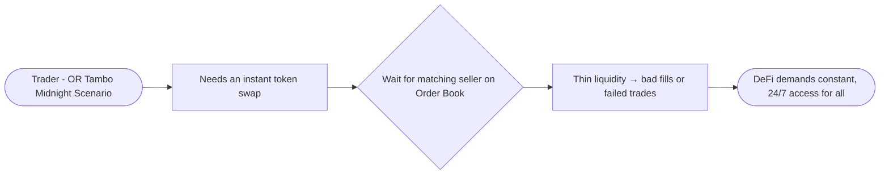
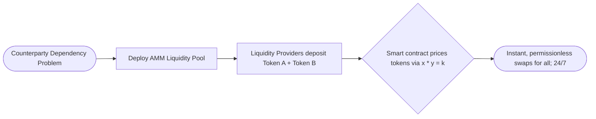
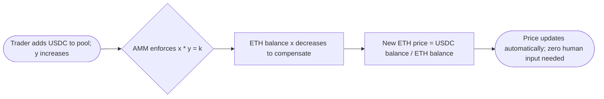
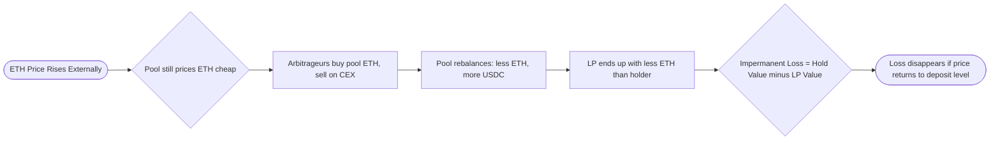

# Automated Market Makers (AMMs): DeFi's Always-On Financial Engine

***

## The Friction of Traditional Markets

Picture yourself at OR Tambo International Airport at midnight. The exchange booth shows R18.50 per USD. You hand over R18,500 expecting 1,000 USD; but you receive only 960 USD. The rate shifted while you waited, available cash was limited, and the booth took a hidden cut. Now scale that frustration to crypto: volatile assets, global time zones, niche tokens, and no guaranteed buyer or seller on the other side. In traditional markets, you can only trade when a human counterparty agrees to your exact deal at your exact moment. No match; no trade, or a terrible one.

This is the core problem AMMs were built to destroy.

***

## The AMM Objective

An AMM replaces the human shopkeeper with an always-open, mathematical vending machine. Instead of matching buyers to sellers, it lets you trade directly against a **liquidity pool**; a smart contract holding a pair of tokens (for example, ETH and USDC) that anyone can deposit into or swap against, at any time, from any wallet.

The mission is clear: eliminate the counterparty dependency, automate pricing via code, and open financial markets to every person on the planet; regardless of location, bank account, or trading hours.

***

## How AMMs Work

**The image is illustrative, not numerically exact**

When an LP adds or removes liquidity, they directly change the **reserve sizes** of both tokens, so **$x$, $y$, and $k$** all change together.

| Adding Liquidity | Removing Liquidity |
| :--- | :--- |
| - LP deposits both tokens in the *current price ratio* (e.g., 1 ETH : 2 000 USDC). - Reserves grow (more ETH and more USDC), so $k$ *increases*. - The *price stays the same*, but the pool is deeper, so each trade now causes *less price impact*. | - LP withdraws both tokens *proportionally* to their pool share. - Reserves shrink, so $k$ *decreases*. - Again, the *price at that moment stays the same*, but the pool becomes shallower, so later trades cause *more price impact*. |

### The Bucket and the See-Saw

Think of a liquidity pool as a large bucket of water, and your trade as a scoop. A full bucket barely ripples when you take out one scoop; that is what we call **low price impact** (deep liquidity). However, if the bucket is nearly empty, that same scoop drastically changes the water level; meaning **high price impact** (shallow liquidity). 

Now, imagine that bucket balanced on a see-saw: when the water (Token A) on one side decreases, the other side (Token B) must rise to keep everything in balance. That see-saw dynamic is the mathematical formula running the show.

### The Formula That Runs It All

Most AMMs use the **constant product formula**:

$$
x \times y = k
$$

Where $x$ is the amount of Token A, $y$ is the amount of Token B, and $k$ is a constant that must never change during a swap. When you buy Token A, $x$ falls, so $y$ must rise to keep $k$ stable. This automatically makes Token A more expensive as it becomes scarcer in the pool. The spot price at any moment is simply the ratio:

$$
\text{Spot Price} = \frac{y}{x}
$$

### Slippage: The Execution Gap

**Slippage** is the difference between the price you *expect* when you submit your trade and the price you *actually receive* when it executes. Expecting \$1.00 but paying \$1.05 is 5% slippage. In AMMs, there are two culprits:

- **Trade size vs pool depth:** Larger trades shift the token ratio further along the pricing curve, worsening your execution.
- **Blockchain confirmation delay:** Your transaction sits in the mempool for a few seconds. During that window, bots or other traders may jump ahead of you; a practice known as frontrunning; moving the pool price before your trade confirms.

> *Slippage is a timing and size problem. Price impact is a liquidity depth problem. They are related but distinct.*

### Price Impact: Your Trade's Footprint

Price impact measures how much *your specific trade* moves the pool's market price, expressed as a percentage above (or below) the market rate.

$$
\text{Price Impact} = \frac{\text{Execution Price} - \text{Market Price}}{\text{Market Price}} \times 100\%
$$

**Let's walk through a real-world example**:

| Step | Calculation | Result |
| :-- | :-- | :-- |
| Pool setup | 1,000 ETH × 2,000,000 USDC | $k$ = 2,000,000,000 |
| Trade size (after 3% fee) | 100,000 − 3,000 | 97,000 USDC enters pool |
| New USDC balance | 2,000,000 + 97,000 | 2,097,000 USDC |
| New ETH balance | 2,000,000,000 ÷ 2,097,000 | 953.74 ETH |
| ETH received | 1,000 − 953.74 | 46.26 ETH |
| Execution price | 100,000 ÷ 46.26 | ~2,162 USDC/ETH |
| **Price Impact** | (2,162 − 2,000) ÷ 2,000 × 100% | **~6.38% above market** |

You paid 6.38% more than the market price; purely because your trade moved the pool. For traders, this means splitting large trades across time or choosing deeper pools to minimise this cost. For LPs, this premium is captured as fees; making price impact a net benefit from their perspective.

### Impermanent Loss: The LP's Hidden Trade-Off

For Liquidity Providers, AMMs introduce a unique risk called **impermanent loss**: a temporary shortfall in value compared to simply holding your tokens in a wallet, caused when the external market price diverges from your deposit price.

Here is a step-by-step look at how this unfolds:

**Starting state:**

- Deposit: 10 ETH + 20,000 USDC → $k = 200,000$, ETH pool price = 2,000 USDC
- Total LP portfolio value: **\$40,000**
- A simple holder's value: also **\$40,000**

**ETH rises to 4,000 USDC on the external market:**

- The pool still prices ETH at 2,000 USDC; a profitable gap for arbitrageurs
- They buy cheap ETH from the pool, selling it on centralised exchanges until pool price = 4,000

**Solving for the new pool balance using $x \times y = k$:**

$$
\text{ETH price} = \frac{y}{x} = 4{,}000 \Rightarrow y = 4{,}000x
$$

$$
x \times 4{,}000x = 200{,}000 \Rightarrow x = \sqrt{\frac{200{,}000}{4{,}000}} \approx 7.071 \text{ ETH}
$$

**New pool state:** ~7.071 ETH + ~28,284.54 USDC → still $k = 200,000$

| Scenario | ETH Value | USDC Value | Total |
| :-- | :-- | :-- | :-- |
| **Simple Holder** | 10 ETH × \$4,000 = \$40,000 | \$20,000 | **\$60,000** |
| **LP Portfolio** | 7.071 ETH × \$4,000 = \$28,284 | \$28,284.54 | **\$56,568.54** |
| **Impermanent Loss** |; |; | **−\$3,431.46 (~5.7%)** |

The LP earned a profit (\$40,000 → \$56,568.54) but missed out on \$3,431.46 compared to simply holding. Crucially; if ETH's price returns to \$2,000, the impermanent loss **disappears entirely**. It only becomes permanent if you withdraw your liquidity while the price divergence persists.

***

## Real-World Impact and Applications

AMMs have fundamentally democratised finance. Anyone with a wallet and internet connection can now swap tokens, earn passive income as an LP, and participate in markets that never sleep; without permission from any bank or exchange.

| Application | Example Use | Key Benefit | Key Risk |
| :-- | :-- | :-- | :-- |
| **Instant token swap** | ETH → USDC on Uniswap. | 24/7, no counterparty needed. | Slippage on volatile tokens. |
| **Provide liquidity** | Deposit ETH + USDC to earn fees. | Passive yield from trading activity. | Impermanent loss on price divergence. |
| **Minimise price impact** | Use high-TVL pools for large trades. | Better execution price, lower slippage. | Larger pools still have limits. |
| **Protect against frontrunning** | Set a 1–2% slippage tolerance. | Rejects fills worse than your threshold. | Too tight a tolerance = failed transaction. |
| **Hedge IL exposure** | LP in correlated or stable pairs. | Lower price divergence = lower IL. | Reduced fee earnings from lower volatility. |

### Hands-On: Try It Yourself

1. **Feel price impact live:** Open Uniswap (testnet), enter a tiny trade and then a massive trade in the same pool. Watch the "Price Impact" warning grow; that is $k$ at work in real time.
2. **Trace the constant:** Find any live DEX pool, note its two token balances, multiply them to get $k$, then predict the new price for a hypothetical swap before executing.
3. **Model impermanent loss yourself:** Build a spreadsheet with the 10 ETH / 20,000 USDC example. Plot your LP value versus a simple holder's value at ETH prices of 1,000, 2,000, 3,000, and 4,000 USDC. Watch the gap appear and disappear as price moves.

***

***Do not just use DeFi but be fluent in it as well. I highly recommend opening up a pool explorer today. Trace a live trade from input to output, and watch these mechanics click into place for yourself.***

⁂

